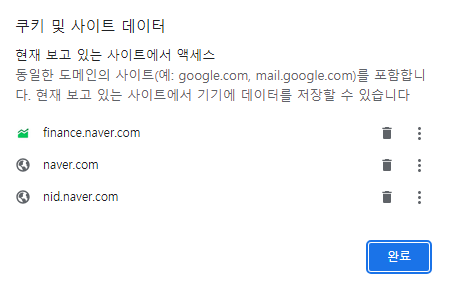

## 1. cookie란 무엇인가?

#### **한줄 요약 : 사이트를 이용할 때 브라우저에 저장되는 사용자의 덜 중요한 데이터**

- 사용자의 브라우저에 저장되고, 통신할 때 HTTP 헤더에 포함되는 텍스트 데이터 파일
- 이름, 값 만료기간(지정 가능), 경로 정보가 있고 키와 값으로 구성
- 사용자의 편의를 위하되, 지워지거나 조작되거나 가로채이더라도 큰 일이 없을 정보들, 보안성이 낮음

- 예를 들면, 자동 로그인 유지, 공지 보지 않기, 로그인 안한 상태로 장바구니 담기
- cookie.png

  

## 2. session이란 무엇인가?

#### **한줄 요약 : 사이트를 이용할 때 서버에 저장되는 사용자의 중요한 데이터**

- 서버'에 저장되는 쿠키
- 클라이언트와 서버의 통신 상태, 주로 중요한 데이터를 저장 시 사용
- 브라우저를 종료할 때까지 유지 됨
- 사용자 로컬이 아닌 서버에 직접 저장되므로, 세션 내의 데이터를 탈취하는 것은 어려움 -> 보안성이 비교적 높음

| | 쿠키(cookie) | 세션(session) |
| -------- | -------- | -------- |
| 저장위치 | 클라이언트 | 서버 |
| 보안 | 변질 우려로 인해 보안 취약 | 비교적 보안성이 좋음 |
| 라이프 사이클 | 만료 기간 지정, 브라우저 종료 시에도 유지 | 브라우저 종료시 삭제(기간 지정 가능) |
| 속도 | 빠름 | 느림 |

## 3. cache란 무엇인가?

#### **한줄 요약 : 재사용될 것 같거나, 용량이 큰 리소스를 임시로 저장해두어서 렌더링 속도를 높임**

- 웹 페이지 요소를 저장하기 위한 임시 저장소
- 다시 사용될 확률이 있는 데이터들을 빠르게 접근 가능한 저장소에 저장
- 이미지와 같이 재사용될 것 같거나 용량이 큰 리소스를 임시로 저장해두어서 렌더링 속도를 높임
- 이미 한번 다운로드 파일은 바로 열 수 있음
- 캐시를 최신 상태로 유지하는 것이 어려움
- 캐시는 사용자가 수동으로 직접 삭제해주어야 함